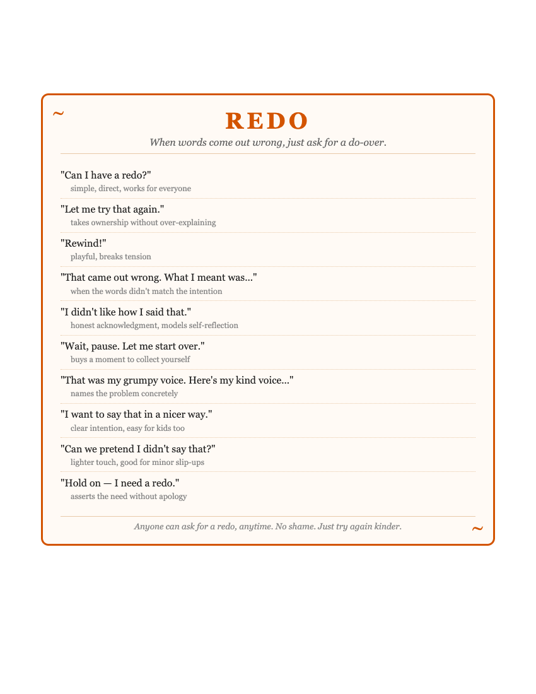
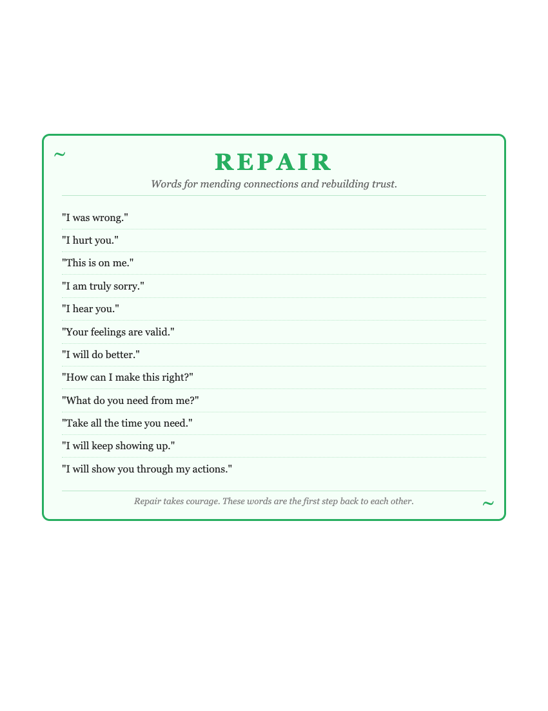
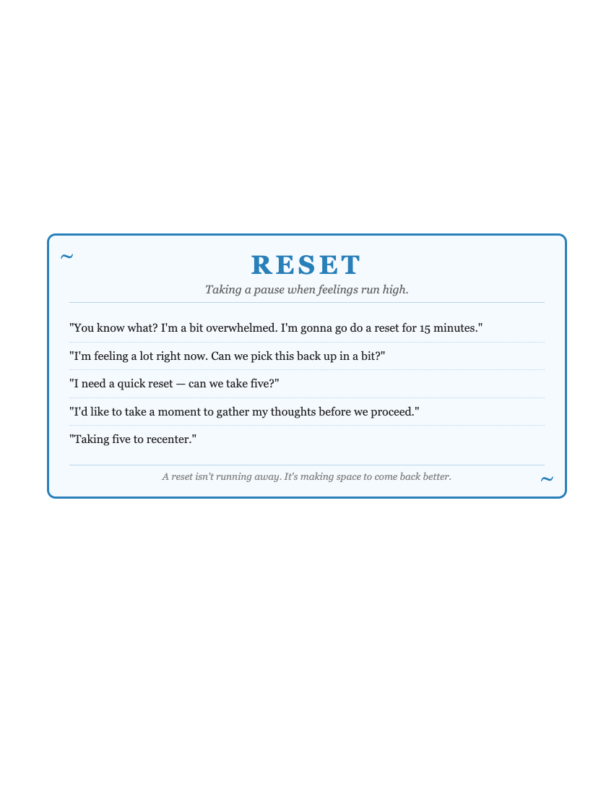
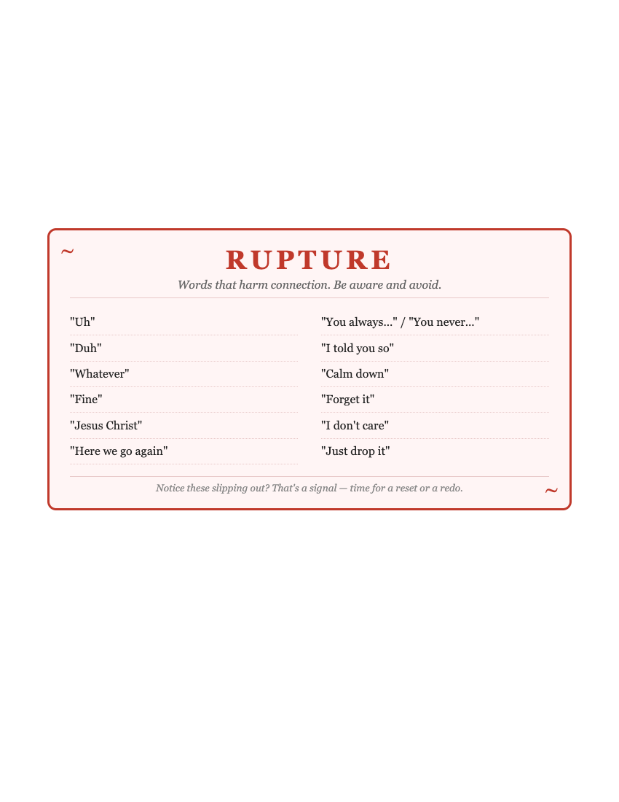

# Redo, Reset, Repair

A shared family vocabulary for healthier communication.

## Why This Exists

Conflict is inevitable. Rupture happens. What matters is what comes next.

This project captures phrases that help families navigate tough moments—not by avoiding conflict, but by giving everyone the words to pause, try again, and reconnect. When a 5-year-old can say "Can I have a redo?" or a parent can model "I didn't like how I said that," everyone learns that mistakes aren't failures—they're chances to practice doing better.

## The Four Rs

| Concept | Purpose |
|---------|---------|
| **Redo** | Ask for a do-over when words come out wrong |
| **Reset** | Take a pause when feelings run high |
| **Repair** | Mend connections and rebuild trust |
| **Rupture** | Words to notice and avoid—signals that it's time for a redo or reset |

## Printable Posts

Fridge-ready reminders for the whole family:

### Redo

### Repair

### Reset

### Rupture

## Usage

Print the HTML files in `posts/` for letter-size fridge art, or use the markdown files directly as reference
